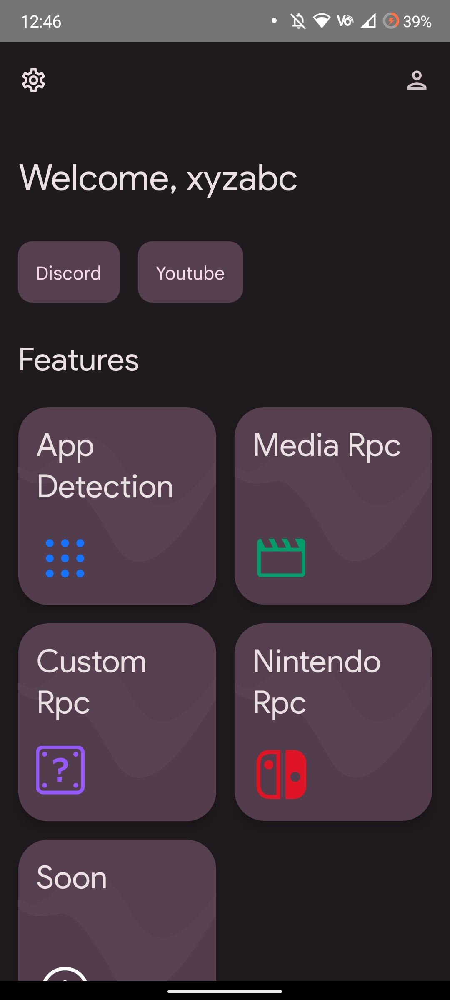
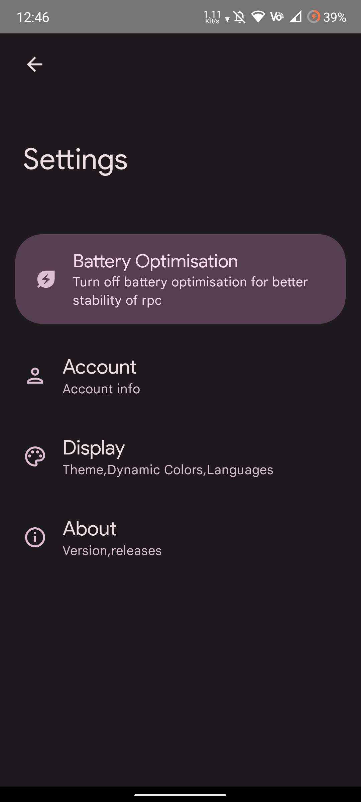
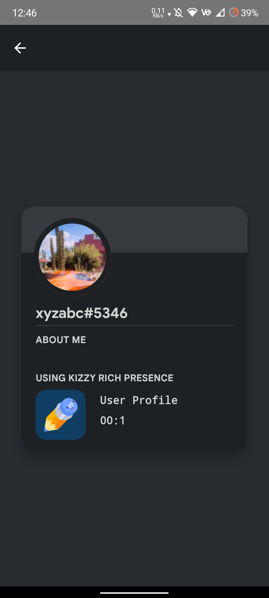
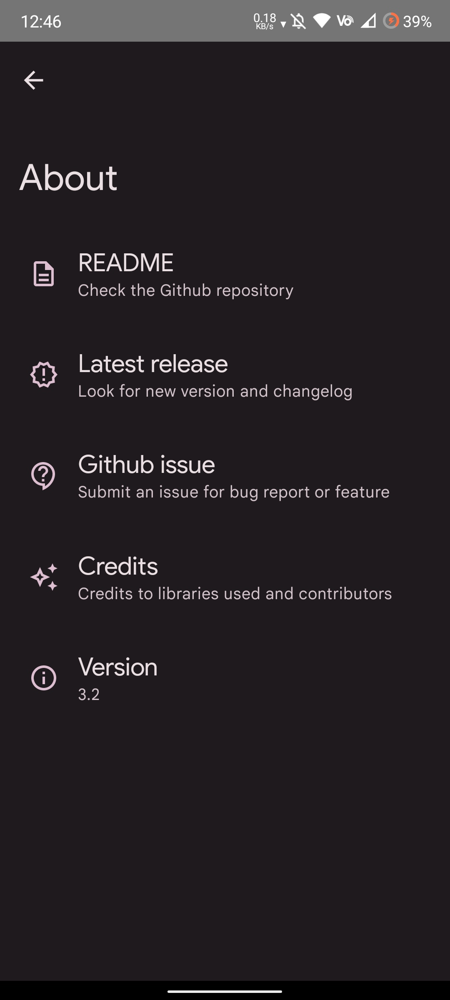
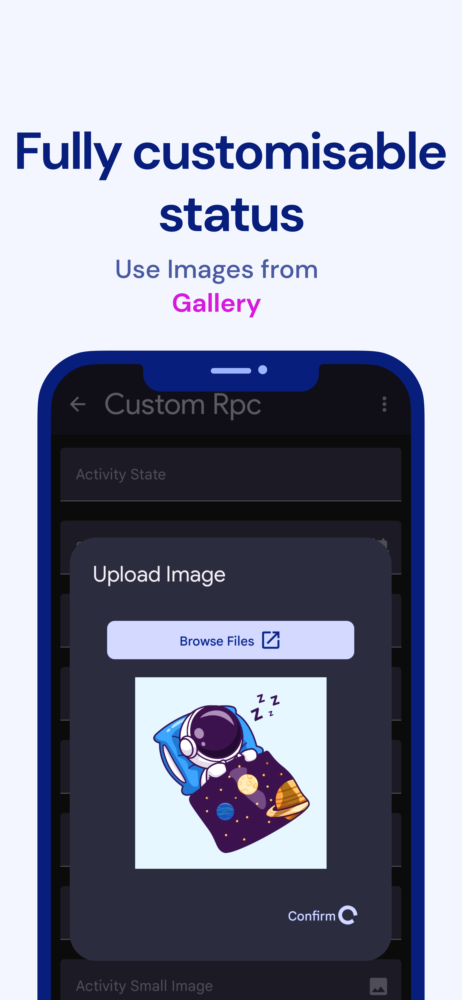

<div align="center">
    
</div>
<br>

<div align="center">


<a href="https://github.com/dead8309/Kizzy/releases/latest">

</a>


<a href="https://discord.gg/vUPc7zzpV5">

</a>
</div>

<div align="center">
<h1>Kizzy</h1>
<h4>A Discord Rich Presence manager for Android fully written in Kotlin.
</h4>
<p>

</p>
</div>

## Download
<a href="https://github.com/dead8309/Kizzy/releases/latest">

</a>


## Screenshots
<div>





</div>

## Features

- [x] Clickable buttons
- [x] Clean UI
- [x] Detects current Running app
- [x] Detects Current Playing media
- [x] Optional timestamps
- [x] Custom Status
- [x] Save/Load presence configs
- [x] Material You theme
- [x] Translations
- [x] Easy [Setup](https://kizzy.gitbook.io/kizzy-docs/setup/setting-up-the-app) 
- [x] Predefined presets(Nintendo,Wii Rpc have 200+ options)
- [x] Create custom configs with your own images and links
- [x] Preview Rpc in the app itself
- [x] Runs in background even when screen is off
- [x] Gif support
- [x] External Url support (meaning you can give a url which points to an image on the web and discord will show it!) [How it works ?](https://github.com/dead8309/Kizzy/blob/bd070025f2194ab888f908f7796c6c924555e786/app/src/main/java/com/my/kizzy/rpc/ImageResolver.kt)

## Getting Started
Read the Setup Guide [at Gitbook](https://kizzy.gitbook.io/kizzy-docs/setup/setting-up-the-app)
or watch the tutorial video
[](https://www.youtube.com/embed/kjPDMHgsOcU)


## Documentation
Check out our  [Docs](https://kizzy.gitbook.io/kizzy-docs/) at Gitbook


## Build
For building the app locally
> Prerequisites:
- Android Studio
- Familiar with Gradle, Kotlin, Jetpack Compose

> Clone the project
```console
git clone https://github.com/dead8309/Kizzy.git
```
> Building
- Open Android Studio
- Import the project
- Click on Build and Run

## Translate
See [Contribute for Translation](https://github.com/dead8309/Kizzy/issues/2#issue-1370365856)


### Credits
✨ [Read You](https://github.com/Ashinch/ReadYou) and [Seal](https://github.com/JunkFood02/Seal) for Ui Components

✨ [md3compat](https://github.com/re-ovo/md3compat) for Material You library

✨ [Rich-Presence-U](https://github.com/ninstar/Rich-Presence-U) for Nintendo and Wii U games data

### Licence 
[](https://www.gnu.org/licenses/gpl-3.0)
