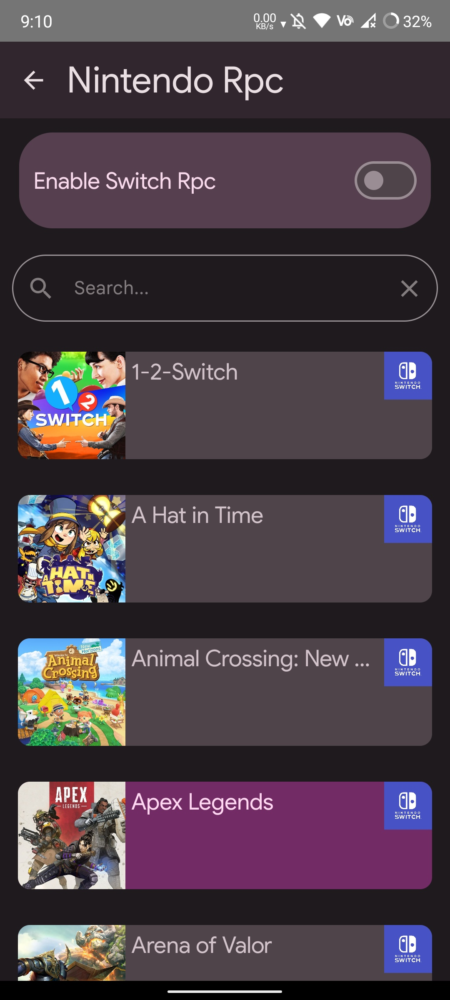
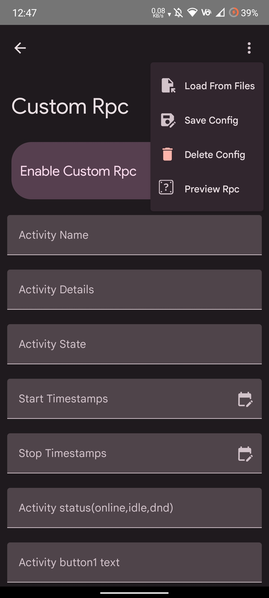
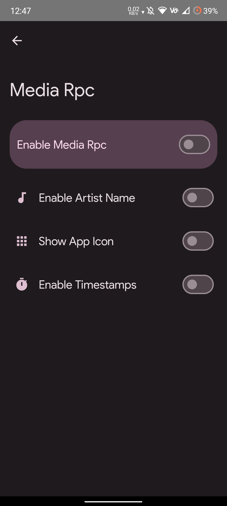
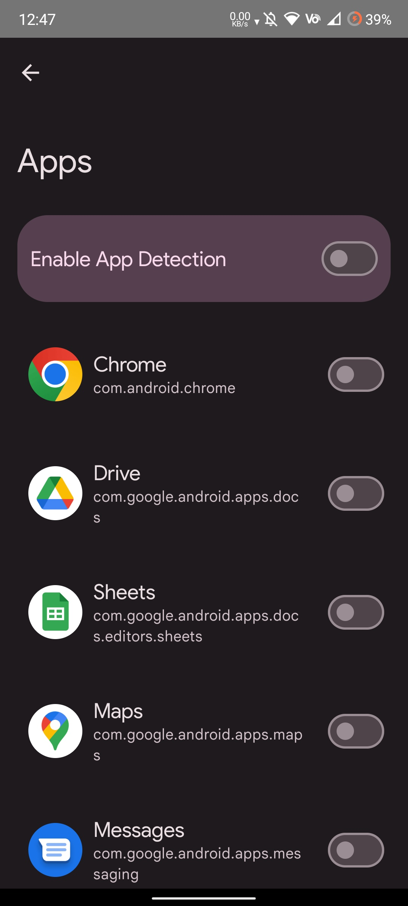

# Kizzy

A rich presence manager for managing discord's rich presence on `Android`

(https://discord.gg/vUPc7zzpV5)

### Check out Docs at [GitBook](https://kizzy.gitbook.io/kizzy-docs/) 

### Screenshot

### Credits
✨ [Read You](https://github.com/Ashinch/ReadYou) and [Seal](https://github.com/JunkFood02/Seal) for Ui Components

✨ [md3compat](https://github.com/re-ovo/md3compat) for Material You library

✨ [Rich-Presence-U](https://github.com/ninstar/Rich-Presence-U) for Nintendo and Wii U games data

### Licence 

